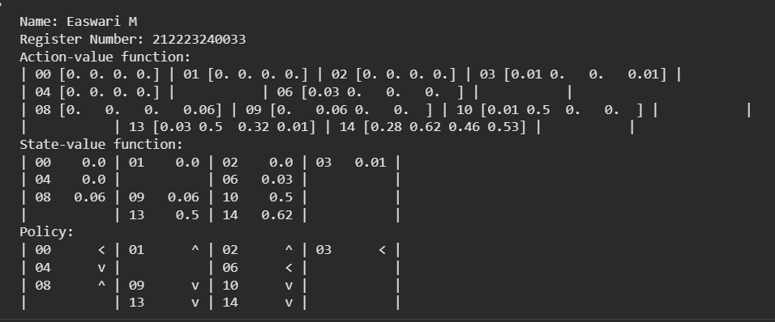
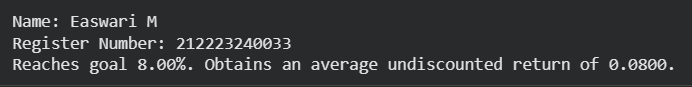

# MONTE CARLO CONTROL ALGORITHM

## AIM
To develop a Python program to find the optimal policy for the given RL environment using the Monte Carlo algorithm.

## PROBLEM STATEMENT
For the given environment using Reinforcement Learning methods,estimate the action value functions and derive an optimal policy for an unknown episodic environment using Monte Carlo sampling based control methods.

## MONTE CARLO CONTROL ALGORITHM

### Step-1:
Initialize action-value estimates and a policy, ensure exploring starts or apply an epsilon-soft policy for exploration.

### Step-2:
Generate complete episodes by following the current policy, recording state, action, and reward sequences until termination.

### Step-3:
For each state-action pair in an episode, compute the return from first occurrence and accumulate for averaging updates.

### Step-5:
Update action-value estimates by incremental averaging or weighted returns, then improve the policy greedily with exploration.

### Step-6:
Repeat episode generation and updates until convergence; evaluate learned policy's performance and stability over multiple runs.


## MONTE CARLO CONTROL FUNCTION
```
def mc_control(env,
               gamma=1.0,
               init_alpha=0.5,
               min_alpha=0.01,
               alpha_decay_ratio=0.5,
               init_epsilon=1.0,
               min_epsilon=0.1,
               epsilon_decay_ratio=0.9,
               n_episodes=3000,
               max_steps=200,
               first_visit=True):

    nS, nA = env.observation_space.n, env.action_space.n

    discounts = np.logspace(
        0, max_steps,
        num=max_steps, base=gamma,
        endpoint=False)

    alphas = decay_schedule(
        init_alpha, min_alpha,
        alpha_decay_ratio,
        n_episodes)

    epsilons = decay_schedule(
        init_epsilon, min_epsilon,
        epsilon_decay_ratio,
        n_episodes)

    pi_track = []
    Q = np.zeros((nS, nA), dtype=np.float64)
    Q_track = np.zeros((n_episodes, nS, nA), dtype=np.float64)

    select_action = lambda state, Q, epsilon:np.argmax(Q[state]) if np.random.random() > epsilon else np.random.randint(len(Q[state]))

    for e in tqdm(range(n_episodes), leave=False):
        trajectory = generate_trajectory(select_action, Q, epsilons[e], env, max_steps)
        visited = np.zeros((nS, nA), dtype=bool)

        for t, (state, action, reward, _, _) in enumerate(trajectory):
            if visited[state][action] and first_visit:
                continue
            visited[state][action] = True

            n_steps = len(trajectory[t:])
            G = np.sum(discounts[:n_steps] * trajectory[t:, 2])
            Q[state][action] = Q[state][action] + alphas[e] * (G - Q[state][action])

        Q_track[e] = Q
        pi_track.append(np.argmax(Q, axis=1))

    v = np.max(Q, axis=1)
    pi = np.argmax(Q, axis=1)
    return Q, v, pi, Q_track, pi_track
```

## OUTPUT:

### Name: Easwari M
### Register Number: 212223240033

### Action value function, optimal value function, optimal policy


### Success rate for the optimal policy


## RESULT:

Thus the python program to implment Monte Carlo algorithm has been successfully created and output is obtained.